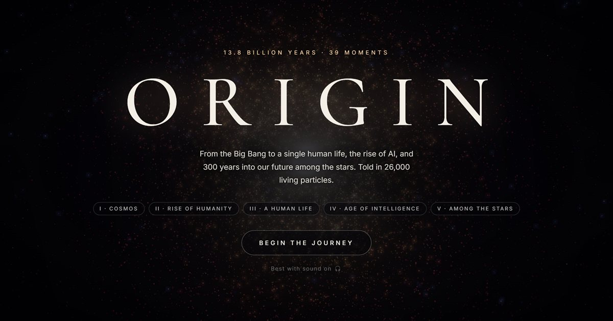

# ORIGIN — From the Big Bang to the Stars
### *13.8 Billion Years in 26,000 Living Particles*

[](https://threejs.org)
[](#technical-architecture)
[](#quick-start--how-to-run)

> *"Every atom in your body was forged in a star. We are the cosmos experiencing itself, waking up to build intelligence and set sail for the stars."*

<p align="center">
  
</p>

---

## 🌌 Overview

**ORIGIN** is an interactive 3D particle odyssey that compresses 13.8 billion years of cosmic history, the rise of human civilisation, the intimate journey of a single human life, the dawn of artificial intelligence, and the next 300 years of interstellar expansion into an ethereal, real-time experience.

Rendered through **26,000 dynamic, living particles** (14,000 on mobile) with zero external 3D models and zero audio asset files, ORIGIN runs entirely inside a **single, standalone HTML file**. Every galaxy, human skeleton, beating heart, neural network, and starship is mathematically synthesized on the fly.

---

## ✨ Key Features

- **39 Curated Moments Across 5 Epochs**: Travel seamlessly from the Big Bang through ancient hominids, human birth, the AI explosion, and humanity's voyage to Alpha Centauri.
- **100% Procedural Generation**: No `.gltf`, `.obj`, or raster texture downloads. Every form is generated via trigonometry, vector math, parametric curves, and noise functions.
- **Dynamic Physics & Interaction**: Push particles with your cursor, scatter them with impulse shockwaves, and rotate around each scene in full 3D space.
- **Real-Time Generative Audio**: An integrated Web Audio API synthesizer generates a dynamic harmonic drone tuned in a pentatonic scale, complete with resonant low-pass LFO sweeps and wind/energy whooshes during transitions.
- **Logarithmic Temporal Counter**: An animated odometer that smoothly glides across cosmological time (*billions of years ago*), historical calendar time (*BCE/CE*), individual human milestones (*days, weeks, and age in years*), and future forecasts.
- **Cinematic Visuals**: Custom GLSL particle shaders, additive alpha blending, ACES Filmic tone mapping, and an UnrealBloom post-processing pipeline.
- **Fully Responsive & Accessible**: Custom desktop timeline scrubber and mobile segment navigation with dedicated touch controls.

---

## 📜 The Five Chapters (39 Moments)

### Chapter I · Cosmos (13.8 Bya – 3.8 Bya)
> *The physical foundation of reality and the origin of organic life.*
1. **The Big Bang** (13.8 Bya) — The universe expands from a primordial singularity.
2. **Stardust** (13.5 Bya) — First stars ignite; stellar nucleosynthesis creates carbon, oxygen, and iron.
3. **Sun & Earth** (4.6 Bya) — Accretion disk, solar ignition, and planetary formation.
4. **First Life** (3.8 Bya) — Hydrothermal vents, dividing single-celled proto-organisms.

### Chapter II · Rise of Humanity (7 Mya – 2026 CE)
> *From African savannas to the threshold of synthetic intelligence.*
5. **The Cradle** (7 Mya) — Continental rift valleys and early hominid beginnings.
6. **First Steps** (3.2 Mya) — *Australopithecus afarensis* ("Lucy") walks upright across the savanna.
7. **Mastery of Fire** (1 Mya) — *Homo erectus* gathers around live flickering embers.
8. **Homo Sapiens** (300,000 ya) — The march of human evolutionary anatomy and cranial expansion.
9. **Out of Africa** (70,000 ya) — Great diaspora across Eurasia, Australia, and the Americas.
10. **The Mind Awakens** (40,000 ya) — Red ochre cave handprints, symbols, and artistic consciousness.
11. **Agriculture** (12,000 ya) — The Fertile Crescent, wild wheat domestication, and settled villages.
12. **Civilization** (4,500 ya) — Monumental architecture, Egyptian pyramids, writing, and early laws.
13. **Industrial Age** (266 ya) — Interlocking rotating gears, steam engines, and coal-powered scale.
14. **Digital Age** (57 ya) — Microchips, lunar landings, and global telecommunication grids.
15. **Intelligence** (Present Day) — You are here; synthetic neural networks begin to reflect our minds.

### Chapter III · A Human Life (Day 1 – Age 88)
> *The universal human journey: intimate, biological, and bittersweet.*
16. **Conception** (Day 1) — One in 250 million sperm meets the egg to form a unique genome.
17. **In the Womb** (Week 24) — Developing fetus with an active, pulsating heartbeat and umbilical cord.
18. **First Breath** (Age 0) — Birth; a newborn enters the world and synaptic connections explode.
19. **Childhood** (Age 6) — Playful motion, curiosity, and learning how the physical world behaves.
20. **The Student** (Age 18) — Absorbing millennia of collective human culture and knowledge.
21. **Work** (Age 27) — The craft: building, coding, farming, and contributing to society.
22. **Love & Family** (Age 34) — Human connection, shared life, and passing the flame to the next generation.
23. **Wanderlust** (Age 45) — Flight arcs spanning Mumbai, New York, Tokyo, and Paris.
24. **Faith & Meaning** (Age 60) — Sacred architecture, glowing diyas, and reflecting on existence.
25. **The Golden Years** (Age 78) — Slower footsteps, elder wisdom, and generational legacy.
26. **Return to Stardust** (Age 88) — The cycle closes; atoms dissolve back into the cosmic field.

### Chapter IV · The Age of Intelligence (2030 CE – 2100 CE)
> *Humanity amplified: partnering with digital minds.*
27. **AI Everywhere** (2030 CE) — Decentralised swarms of AI agents assisting human capability.
28. **Mind Meets Machine** (2035 CE) — High-bandwidth neural interfaces and bio-digital connection.
29. **The Intelligence Explosion** (2045 CE) — Recursive self-improvement branching like a tree of light.
30. **Cities of Tomorrow** (2050 CE) — Vertical green forests, sustainable arcologies, and autonomous transit.
31. **Healing the Planet** (2060 CE) — Rewilding, carbon capture, and planetary stewardship.
32. **Rewriting Biology** (2070 CE) — DNA nanomachinery, longevity therapies, and eradicated diseases.
33. **The Global Mind** (2100 CE) — Billions of humans and AI nodes linked in symbiotic harmony.

### Chapter V · Among the Stars (2040 CE – 2326 CE)
> *Stepping off the cradle and into the galactic ocean.*
34. **Moon Base** (2040 CE) — South pole lunar habitats and fuel extraction (honouring Chandrayaan-3).
35. **Mars, Second Home** (2080 CE) — Geodesic dome cities beneath Martian skies.
36. **Jupiter's Moons** (2150 CE) — Probing the deep subterranean oceans of Europa.
37. **Harnessing the Sun** (2200 CE) — A Kardashev Type II Dyson swarm harvesting stellar energy.
38. **Orbital Cities** (2220 CE) — Rotating O'Neill cylinders with internal ecosystems in orbit.
39. **To the Stars** (2326 CE) — Relativistic light-sail vessels departing for Alpha Centauri.

---

## 🎮 Interactive Controls

| Input | Action |
| :--- | :--- |
| **Mouse Drag / Touch Drag** | Orbit and rotate the camera in 3D space |
| **Mouse Move** | Push and disturb particles via real-time raycasting |
| **Click / Tap** | Trigger an impulse shockwave that scatters particles with audio feedback |
| **`→` / `↓` / `PageDown`** | Advance to the next moment |
| **`←` / `↑` / `PageUp`** | Return to the previous moment |
| **Mouse Wheel** | Scroll forward/backward through the timeline |
| **`Space`** | Toggle Auto-Tour mode (advances automatically every 7.5 seconds) |
| **`1` – `5`** | Instant jump to Chapter I, II, III, IV, or V |
| **`H`** | Toggle minimalist view (hides/shows all UI elements) |
| **`M`** | Toggle Web Audio soundscape and sound effects |
| **Mobile Swipe Up/Down** | Navigate through eras |

---

## 🛠️ Technical Architecture

ORIGIN was engineered with an ultra-lean, zero-bloat philosophy:

```
origin/
├── index.html                   # Complete application (HTML, CSS, Three.js, Shaders, Audio)
├── favicon.svg                  # Vector cosmic particle brand icon & favicon
├── og-image.jpg                 # Optimized 1200x630 social preview image (WhatsApp/X/LinkedIn)
├── .gitignore                   # Git configuration (clean ignore rules)
└── README.md                    # Project documentation
```

### 1. Zero External Assets
- **No 3D Models**: No heavy GLB/GLTF/FBX models. Skeletal humans, fetuses, walking gaits, Dyson spheres, and spacecraft are synthesized via parametric formulas.
- **No Audio Files**: No MP3/WAV assets. Sound is synthesized at runtime with the browser's native `AudioContext`, oscillators, biquad filters, and generated noise buffers.
- **Pure Web Standards**: HTML5, ES Modules, and Vanilla CSS with zero build step required.

### 2. High-Performance Particle Engine
- **Single Draw Call**: All 26,000 particles exist in a single `THREE.BufferGeometry` drawn with `THREE.Points`.
- **Custom Shaders**:
  - `vertexShader`: Dynamically scales particles by camera distance, depth, and individualized twinkle frequencies.
  - `fragmentShader`: Soft circular radial falloff with additive glow blending (`THREE.AdditiveBlending`).
- **Spring-Mass Physics**: Each particle is governed by individual stiffness and damping coefficients, allowing fluid transitions between vastly different structures.
- **Spatial Force Field**: Cursor raycasting computes distances from pointer vectors to particles in 3D coordinates, applying repulsion and shockwaves.

### 3. Procedural Audio Synthesizer
- Multi-oscillator drone tuned to a pentatonic harmonic scale (`noteFor(i) = 55 * PENT[i % 5] * 2^(floor(i/5) % 3)`).
- Low-pass biquad filter modulated by a slow LFO for breathing ambience.
- White-noise bandpass filter sweep with exponential frequency ramps for dynamic transition whooshes.

---

## 🚀 Quick Start / How to Run

### Method 1: Direct File Launch
Simply double-click or open [`index.html`](index.html) in any modern web browser (Chrome, Edge, Firefox, Safari, Brave).

### Method 2: Local Static Server
If you prefer running via a local development server:

```bash
# Using Python:
python -m http.server 8000

# Or using Node.js:
npx serve .
```
Then navigate to `http://localhost:8000` (or `http://localhost:3000`).

### Method 3: GitHub Pages Deployment
Navigate to **Settings > Pages** in your GitHub repository, set **Source: Deploy from a branch**, and select the `main` branch with `/ (root)` folder. Your project will be live with zero build configuration!

---

## 🧭 Guided Tour & Key Highlights

| Chapter | Key Milestone | Navigation | Visual & Sonic Experience |
| :--- | :--- | :--- | :--- |
| **I · Cosmos** | **The Big Bang** | Press `1` | Primordial singularity expansion into swirling stellar nurseries accompanied by deep resonant harmonic drones. |
| **II · Rise of Humanity** | **First Steps (Lucy)** | Press `2` then `→` | Procedural bipedal hominid skeleton walking across African savanna terrain with dynamic dust drift. |
| **III · A Human Life** | **Womb → Stardust** | Press `3` | Intimate human journey: pulsating fetal heartbeat, life milestones, culminating in human form dissolving into cosmic particles. |
| **IV · Age of Intelligence** | **Intelligence Explosion** | Press `4` then `→` | Synaptic neural trees of light branching recursively with harmonic shimmer synthesis. |
| **V · Among the Stars** | **To the Stars** | Press `5` | Relativistic light-sail vessels departing for Alpha Centauri alongside solar Dyson swarms. |
| **Live Interaction** | **Force Field & Shockwaves** | Cursor / Click | Real-time 3D raycasting displaces particles on hover; clicking releases high-velocity impulse shockwaves. |

---

## 📊 Key Numbers

| Metric | Value |
| :--- | :--- |
| **Total Scenes** | **39** immersive moments |
| **Chapters** | **5** distinct epochs |
| **Live Particles** | **26,000** (Desktop) / **14,000** (Mobile) |
| **Timeline Span** | **13.8 Billion Years** → **Year 2326 CE** |
| **File Count** | **1 single HTML file** |
| **External 3D Models** | **0** (100% procedurally generated) |
| **Audio File Size** | **0 bytes** (Synthesized in real-time) |
| **Build Dependencies** | **0** (Pure Web Standards) |

---

## 💡 Built With

- **[Three.js](https://threejs.org/)** — WebGL 3D rendering library
- **Web Audio API** — Real-time browser audio synthesis
- **GLSL Shaders** — Custom vertex and fragment point shaders
- **Google Fonts** — *Cormorant Garamond* & *Inter*
